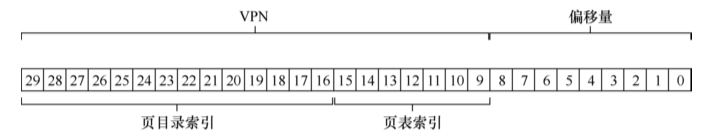
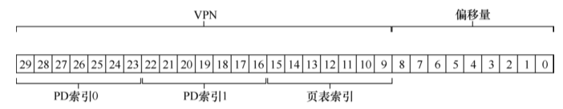
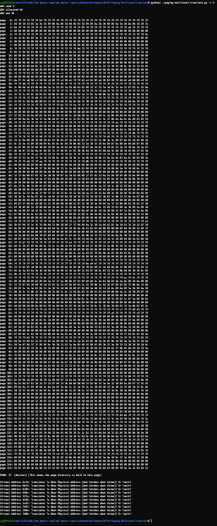

# 20

## Q1

### 分析1

问题问需要多少个寄存器，首先明确寄存器是用来干什么的。

上面两幅图篇分别是书中表示2级页表和3级页表的.

二级页表需要两个寄存器,一个页目录索引寄存器,一个是页表索引寄存器.

三级页表需要三个寄存器,一个是一级页目录索引寄存器,第二个是二级页目录索引寄存器,第三个是页表索引寄存器.

## Q2

用三条指令分别看一下输出

在最小字体下的输出结果就很大,所以仅仅针对其中第一个地址的寻找和取值分析.

第一个地址在命令行下的输出结果是这样的.

~~~shell
PDBR: 108  (decimal) [This means the page directory is held in this page]
Virtual Address 611c: Translates To What Physical Address (And Fetches what Value)? Or Fault?
~~~

需要分解这个虚拟地址`611c`先转换为二进制`11000 01000 11100`.

根据README可以知道每个寄存器的位数.

>- The page size is an unrealistically-small 32 bytes\
>- The virtual address space for the process in question (assume there is only one) is 1024 pages, or 32 KB
>- physical memory consists of 128 pages
> Thus, a virtual address needs 15 bits (5 for the offset, 10 for the VPN). A physical address requires 12 bits (5 offset, 7 for the PFN).

由此可以知道5位offset,10位的`VPN`,其中5位的`PDE`,5位的`PTE`

首先第一步:找到这个地址的`PDE`页目录项:`11000`(24),

在page108的第24项中取出值`a1`.翻译为二进制`10100001`,第一位是有效位,说明有效继续查找,剩下的位为`010 0001`(33)

`page 108: 83 fe e0 da 7f d4 7f eb be 9e d5 ad e4 ac 90 d6 92 d8 c1 f8 9f e1 ed e9 a1 e8 c7 c2 a9 d1 db ff`

根据VPN的非PDE项`01000`(8), 找到page33的8号, 内容为:`b5`,转化为二进制:`10110101`,第一位为有效位,说明有效,,剩下位是`0110101`(53)

`page  33: 7f 7f 7f 7f 7f 7f 7f 7f b5 7f 9d 7f 7f 7f 7f 7f 7f 7f 7f 7f 7f 7f 7f 7f 7f 7f f6 b1 7f 7f 7f 7f`

那么实际物理地址为现在去除的内容`0110101`(53)和offset`11100`(28)拼起来.得到`011010111100`(0x6bc)

那么现在offset和PN都知道了,可以直接找page53的28号,其内容是`08`. 

`page  53: 0f 0c 18 09 0e 12 1c 0f 08 17 13 07 1c 1e 19 1b 09 16 1b 15 0e 03 0d 12 1c 1d 0e 1a 08 18 11 00`

至此,找到了这个虚拟地址的内容`08`.

## Q 3

### 分析

它不适合时间局部性或空间局部性，因此会导致访问缓慢。